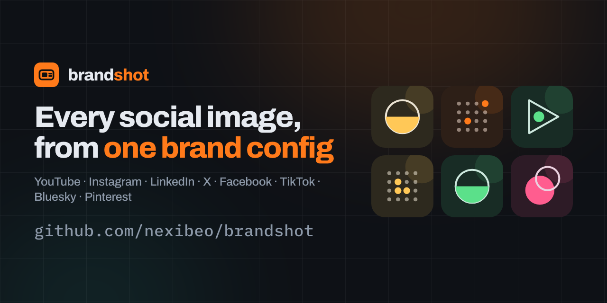
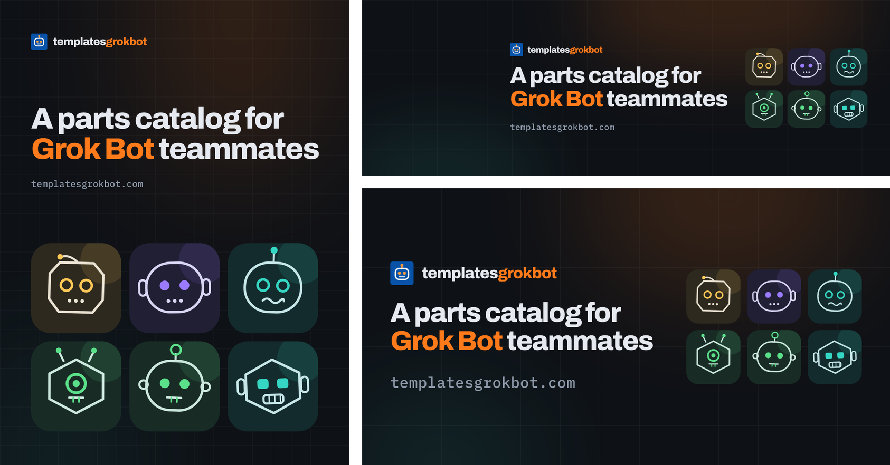
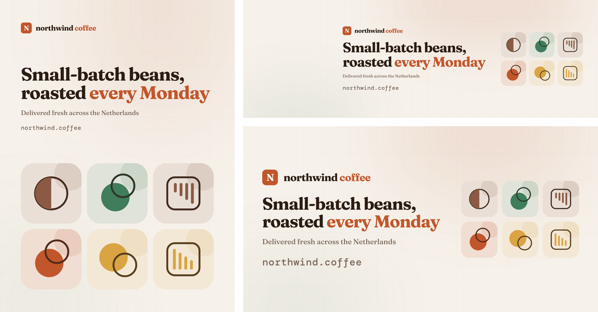
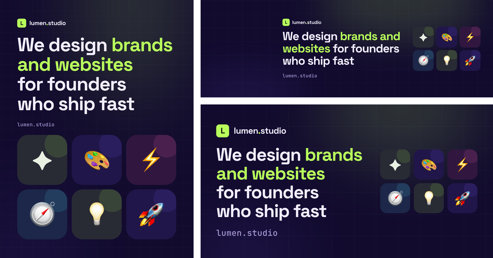

<p align="center">
  
</p>

<h1 align="center">brandshot</h1>

<p align="center">
  <b>One brand config in. Every social profile picture, banner and post out, each at its platform's exact size.</b><br/>
  YouTube · Instagram · LinkedIn · X · Facebook · TikTok · Bluesky · Pinterest · Open Graph · GitHub
</p>

<p align="center">
  <a href="https://nexibeo.github.io/brandshot/studio/"><b>Open the studio</b></a> ·
  <a href="#cli">CLI</a> ·
  <a href="#claude-skill">Claude skill</a> ·
  <a href="#chatgpt-skill">ChatGPT skill</a> ·
  <a href="docs/platform-specs.md">Platform specs</a>
</p>

---

Every platform wants different sizes, crops each image differently, and puts your avatar on top of a different corner of your banner. brandshot takes care of that. You describe the brand once (name, headline, colours, fonts, logo), and it renders **21 images**, each at the platform's current upload spec. Text stays inside the area every device shows, clear of avatars and app UI.

- **Exact specs, checked September 2026.** They include the recent changes most guides still miss: LinkedIn company covers are now 1512×256, Instagram's grid shows 3:4 tiles, and X can crop 60 px off the top and bottom of the header.
- **Type that fits itself.** Headlines shrink to fit each canvas after the web fonts load, so any copy works in any layout.
- **Four ways to use it.** A [browser studio](https://nexibeo.github.io/brandshot/studio/) with no install, a zero-dependency Node CLI, a Claude skill and a ChatGPT skill. All four share the same templates and produce the same pixels.
- **Nothing to install.** The CLI uses the Chrome you already have, and the studio runs in your browser.

## What you get

| Platform | Images |
| --- | --- |
| **YouTube** | Channel picture 800×800 · Channel banner 2560×1440 (text inside the 1546×423 safe area) |
| **Instagram** | Profile 1080×1080 · Feed post 1080×1440 (3:4) · Square 1080×1080 · Story / Reel cover 1080×1920 |
| **LinkedIn** | Profile photo 800×800 · Company logo 400×400 · Personal background 1584×396 · Company cover 1512×256 |
| **X** | Profile 400×400 · Header 1500×500 |
| **Facebook** | Profile 720×720 · Cover 1640×924 (works at every ratio Facebook shows it) |
| **TikTok** | Profile 720×720 |
| **Bluesky** | Avatar 1000×1000 · Banner 1500×500 |
| **Pinterest** | Profile 600×600 · Standard pin 1000×1500 |
| **Web** | Open Graph link preview 1200×630 · GitHub social preview 1280×640 |

Plus an `index.html` contact sheet showing where each file goes. With the skills, you also get **profile bios and descriptions** written within each platform's character limit.

## Examples

Three very different brands, all from the same templates. The configs are in [`examples/`](examples).

| | |
| --- | --- |
| **[TemplatesGrokBot](examples/templatesgrokbot/brand.json)**: dark theme, own SVG logo, generated robot tiles |  |
| **[Northwind Coffee](examples/northwind-coffee/brand.json)**: light theme, serif type, no logo (monogram), geometric tiles |  |
| **[Lumen Studio](examples/lumen-studio/brand.json)**: violet theme, long wrapping headline, emoji tiles |  |

## Studio

**[nexibeo.github.io/brandshot/studio](https://nexibeo.github.io/brandshot/studio/)**

Type your brand in, pick a colour preset or your own colours, and drop in a logo. Every image previews live, with an optional overlay showing the safe areas. Download one PNG or all of them as a zip. You can also export `brand.json` for the CLI, or copy a link that opens the studio with your brand filled in. Everything runs in your browser and nothing is uploaded.

## CLI

Needs Node 18+ and Chrome, Chromium, Edge or Brave installed. There are no npm dependencies.

```bash
npx github:nexibeo/brandshot init      # writes a starter brand.json
npx github:nexibeo/brandshot           # renders everything into ./brandshot/
```

Or clone the repo and run `node bin/brandshot.mjs`.

| Command | What it does |
| --- | --- |
| `brandshot init` | Write a starter `brand.json`. |
| `brandshot --config brand.json` | Render all 21 images into `./brandshot/` next to the config. |
| `brandshot --only youtube,x-header` | Render a subset: asset ids, platform names or kinds (`profile`, `banner`, `post`, `story`). |
| `brandshot --out social --zip` | Choose the output folder and also write a zip. |
| `brandshot --list` | List every asset with its size (`--json` for machine output). |
| `brandshot --link` | Print a studio link with this config filled in. |
| `brandshot --html` | Keep the HTML pages next to the PNGs. |

If no browser is found, it writes the HTML pages and suggests `--link`. Set `BRANDSHOT_CHROME=/path/to/chrome` to use a specific browser.

### brand.json

```json
{
  "name": "Northwind Coffee",
  "wordmark": "northwind *coffee*",
  "headline": "Small-batch beans,\nroasted *every Monday*",
  "tagline": "Delivered fresh across the Netherlands",
  "url": "northwind.coffee",
  "logo": "logo.svg",
  "theme": { "background": "#F6F1EA", "text": "#2B1D14", "muted": "#7A6557", "accent": "#C2562B", "accent2": "#3F7D5C" },
  "palette": ["#C2562B", "#3F7D5C", "#D9A441", "#8A5A44"],
  "fonts": { "display": "Fraunces:700", "mono": "DM Mono:500" },
  "tiles": { "style": "shapes", "items": ["ethiopia", "colombia", "kenya"] }
}
```

- `*stars*` colour words with the accent.
- `\n` in the headline sets your own line breaks. Those lines never wrap; the font shrinks to fit instead.
- **Fonts:** any Google Fonts family.
- **Logo:** an SVG, PNG, JPG or WebP path, relative to the config.
- **Tiles** are the decorative squares: `robots`, `shapes` (generated from seed words, so the same word always gives the same tile), `emoji`, `images`, or `none`.

All fields: [brand-config reference](skills/brandshot/references/brand-config.md). A [JSON Schema](brand.schema.json) gives you autocomplete in editors.

## Claude skill

The skill finds your brand (logo, colours, fonts, tagline) in the repo or site you're working on, writes `brand.json`, renders everything, reviews the images, fixes what looks off, and writes profile bios within each platform's limit.

**Claude Code: plugin (recommended)**

```
/plugin marketplace add nexibeo/brandshot
/plugin install brandshot@brandshot
```

**Claude Code: copy the skill**

```bash
git clone https://github.com/nexibeo/brandshot && cp -r brandshot/skills/brandshot ~/.claude/skills/
```

**claude.ai / Claude desktop:** download [`dist/brandshot-skill.zip`](dist/brandshot-skill.zip) and upload it in the Skills section of Claude's settings.

**Claude API:** upload the `skills/brandshot` folder with the Skills API ([guide](https://platform.claude.com/docs/en/build-with-claude/skills-guide)).

Then ask: *"Make social media banners and profile pictures for this project"*, or *"Create a YouTube banner and LinkedIn cover for acme.com"*.

## ChatGPT skill

ChatGPT and OpenAI Codex use the same open Agent Skills format (`SKILL.md`), so the same folder works there:

- **ChatGPT:** where your plan supports custom skills, upload [`dist/brandshot-skill.zip`](dist/brandshot-skill.zip).
- **Codex:** add the `skills/brandshot` folder as a skill (see the Codex docs for your version's skills folder).

Where the sandbox has no browser, the skill writes your `brand.json` and bios and gives you a studio link with your brand filled in, where you download the PNGs in one click.

## How it works

```
brand.json ──► src/templates.js ──► one HTML page per asset ──► headless Chrome (CLI)  ──► PNG
                    ▲    (layouts, fit-to-box type)          └► html-to-image (studio) ──► PNG
            src/specs.js (sizes, safe areas, avatar overlaps)
```

- `src/specs.js` is the single source of truth for every size, safe area and text limit. [`docs/platform-specs.md`](docs/platform-specs.md) is generated from it, with sources.
- `src/templates.js` has three layouts (profile, banner, post). Each places text inside the asset's `content` box, which is the part every device shows and no avatar covers.
- `src/tiles.js` generates the decorative tiles, the same from the same seed every time.

```bash
npm test          # spec geometry, config handling, markup safety
npm run build     # regenerate docs/platform-specs.md and the skill bundle
npm run check     # fail if generated files are stale
npm run examples  # render all examples (needs Chrome)
```

## Used in production

brandshot was built for, and is used on, these projects:

- **[nexibeo.com](https://nexibeo.com)**
- **[completeaitraining.com](https://completeaitraining.com)**
- **[templatesgrokbot.com](https://templatesgrokbot.com)**: its whole social kit is the [first example](examples/templatesgrokbot/brand.json)
- **[yougotitall.com](https://yougotitall.com)**

Using brandshot for your brand? Open a PR to add it here.

## Contributing

Platforms change their specs. If an image is cropped wrong somewhere, open an issue with a screenshot and the platform's help link. Sizes live in one file, [`src/specs.js`](src/specs.js). Run `npm run build` after editing it.

## Credits

Created by **Jeroen Erne** ([nexibeo.com](https://nexibeo.com) · [completeaitraining.com](https://completeaitraining.com)), built together with Claude.

## License

[MIT](LICENSE)
